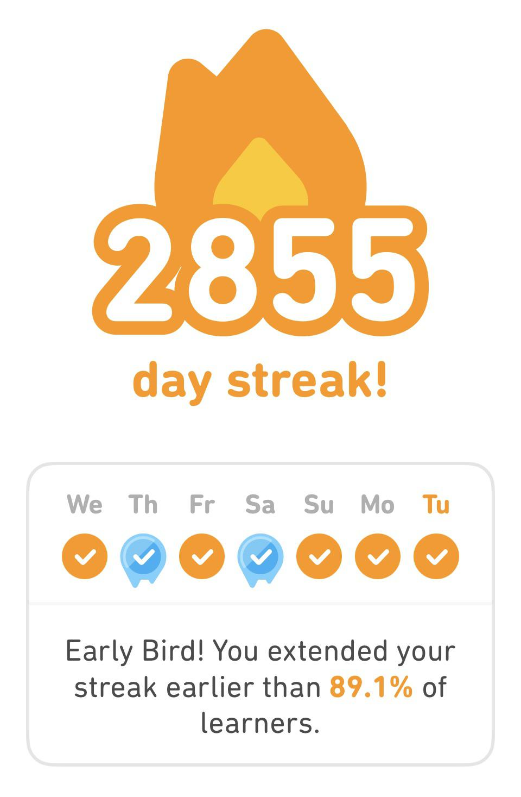
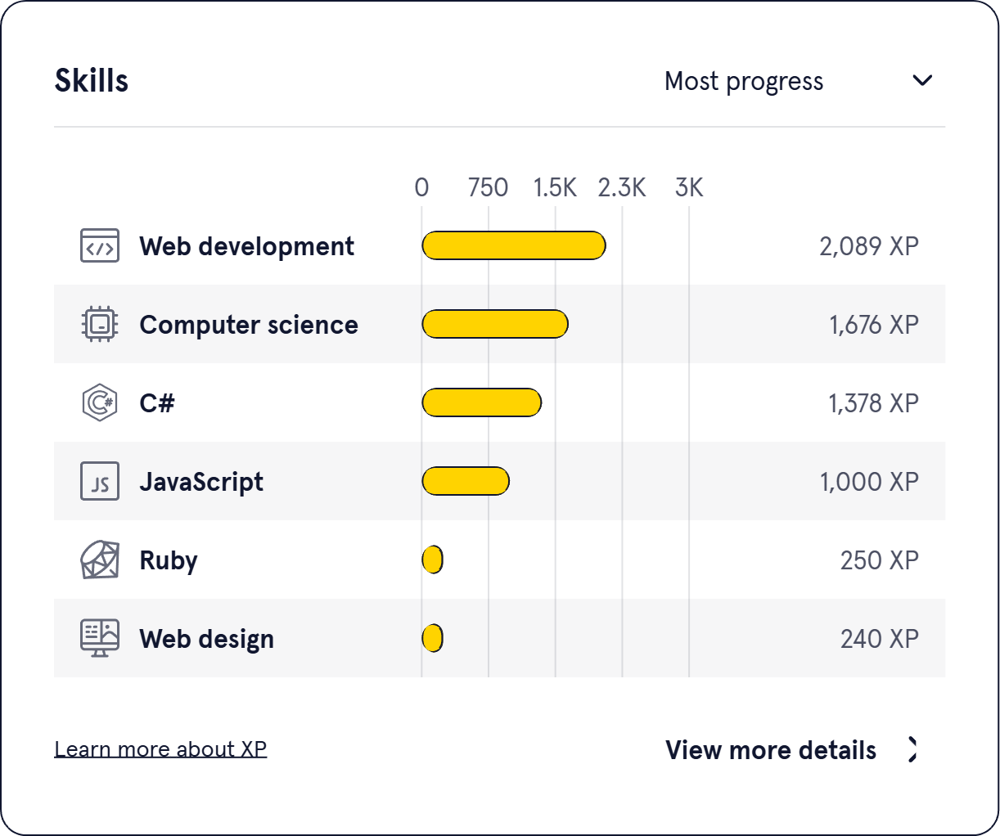

# Dropout Enrollments Command

## **Overview**

This console command automates the process of marking enrollments as **DROPOUT** based on specific conditions.

---

## Setup Instructions

### Prerequisites

* Composer
* PHP 8.x
* Laravel 10+
* MySQL

### Clone the Repository

```bash
git clone https://github.com/ashshidiq23/technical-excercise
cd technical-excercise
```

### Install Dependencies

```bash
composer install
```

### Create a `.env` file

Copy the .env.example file to .env

```bash
cp .env.example .env
```

Set up your database connection in .env:

```dotenv
DB_CONNECTION=mysql
DB_HOST=127.0.0.1
DB_PORT=3306
DB_DATABASE=your_database
DB_USERNAME=your_username
DB_PASSWORD=your_password
```

### Run Migration & Seeder

```bash
php artisan migrate --seed
```

---

## API Documentation

### Dropout Enrollments Command

This command drops out any enrollments that meet the following criteria:

* The enrollment deadline has passed.
* The student has no active exams (`IN_PROGRESS` status).
* The student has no pending submissions (`WAITING_REVIEW` status).

After that, the command will execute:

1. The enrollment status is updated to `DROPOUT`.
2. An activity log entry is created for tracking.

#### Usage

To execute the command, run:

```bash
php artisan enrollments:dropout
```

example output:

```text
Enrollments to be dropped out: 500000
Excluded from drop out: 39401
Final dropped out enrollments: 460599
default/App\Console\Commands\DropOutEnrollments: 30.00 MiB - 68719 ms
```

## Testing Instructions

#### Verify the dropout process manually:

* Before Running the Command, query enrollments that should be dropped based on the latest deadline:

```sql
SELECT *
FROM enrollments
WHERE deadline_at <= (SELECT deadline_at FROM enrollments ORDER BY id DESC LIMIT 1)
  AND status != 'DROPOUT';
```

* Run the command:

```bash
php artisan enrollments:dropout
```

* Check the enrollments table to ensure that the status of the relevant enrollments has been updated to `DROPOUT`:

```sql
SELECT *
FROM enrollments
WHERE status = 'DROPOUT';
```

---

## Product Analysis

### Pain Points

1. **No Learning Progress at a Glance**
    - Users cannot quickly see their course progress, making it difficult to track learning milestones.
    - Proposed Solution: Add a progress bar, completion percentage, and estimated time left for each course.

2. **Blank Page Before Each Question in Quizzes**
    - When loading the next question, a blank page is showing, causing a distracting experience.
    - Proposed Solution: Implement smooth transitions using skeleton loading or preloading the next question in the
      background or make it client-side entirely.

3. **Price Point is Too Steep**
    - The pricing model may not be affordable to all learners.
    - Proposed Solution: Introduce tiered pricing (e.g., Basic, Pro, Premium) and differentiate the feature between them
      e.g. no certificate in Basic Tier, etc.

### Feature Recommendations, Justification, and Solution Design

1. **AI Implementation**
    - **Recommended Learning Path:** AI-driven personalization can help learners choose the most suitable courses based
      on their existing skills, learning pace, and career goals. This helps beginner to choose their preferred learning
      path.
    - **AI Chat in Course Pages:** Many learners struggle with understanding concepts in real-time. An AI-powered
      assistant can provide instant explanations, reducing frustration and increasing retention.

   **Solution Design:**
    - Use LLM to power AI chat.
    - Implement a recommendation engine using machine learning to analyze user progress and suggest courses.
    - Display AI suggestions on the dashboard in an easy-to-read format.

2. **Gamification for Engagement**
    - **Daily Learning Goals:** Encourages consistency, as learners are more likely to stay committed if they have
      short-term, achievable goals. Gamification elements have been proven to increase motivation and user engagement (
      like Duolingo).
      
    - **Badges and Achievements:** Visual indicators of progress provide intrinsic motivation, making learners more
      likely to complete courses (like badge on google developers or microsoft learn).
    - **Skillset Display:** A character sheet-style display helps learners track their growing expertise, reinforcing a
      sense of accomplishment and making their progress more tangible.
      

   **Solution Design:**
    - Add a user profile section displaying earned badges and skill levels.
    - Implement a streak-tracking system that rewards users for consistent learning.
    - Use progress bars and experience points to make progress more engaging.

3. **Minor UI Enhancements and Quality of Life Updates**
    - Learning Path Menu: Convert the learning path menu into a sidebar format to display all options at once, improving
      navigation.
    - Learning Path Testimonials: Display testimonials in a carousel format to showcase more reviews efficiently.
    - Dicoding Mentoring: Add a filter option to sort mentors based on their expertise, making it easier for learners to
      find relevant guidance.
    - Rewards Menu: Show accumulated points directly in the Rewards menu, rather than only in the profile hover section.
   
   **Solution Design:**
    - Redesign UI components to improve visibility and accessibility.
    - Ensure enhancements are lightweight and do not impact site performance.

### Implementation Strategy

To ensure a smooth rollout and faster iteration, features will be released one by one based on priority and user impact.
This allows for incremental improvements, continuous user feedback, and reduced risk.

#### Phase 1: Progress Tracking UI & Performance Optimization

- Develop and test a dashboard update with progress indicators.
- Implement skeleton loaders for quiz questions to reduce flicker.

#### Phase 2: AI Features

- Train an LLM model for AI chat support.
- Develop a recommendation engine for personalized learning paths.

#### Phase 3: Gamification System

- Implement streak tracking, badges, and skillset visualization.
- Develop a user profile section displaying achievements.

#### Phase 4: Full Deployment & Continuous Improvement

- Gradually roll out finalized features platform-wide with proper onboarding.
- Monitor key success metrics and user satisfaction.

*Do A/B testing or beta release on each phase to test the impact of the changes on user engagement and satisfaction.*

---

### Success Metrics

- **User Engagement:** Increase in average session duration and interaction with the platform.
- **Course Completion Rate:** Measure improvement before and after progress tracking implementation.
- **User Satisfaction:** Collect feedback through surveys and track Net Promoter Score (NPS).
